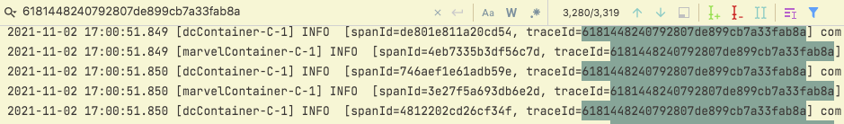

# Tracing

To reproduce issue with TraceId spreading between thread pools do the following: (yes, I'm too lazy to automate it all)

* `docker-compose up --build -d` - from the root
* Launch **tracing-spammer** application
* Check **tracing-handler** application logs

Example of result logs:
